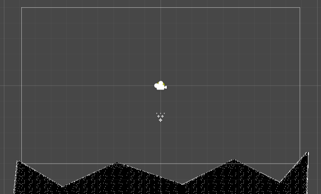
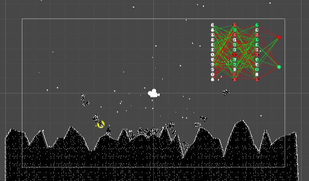
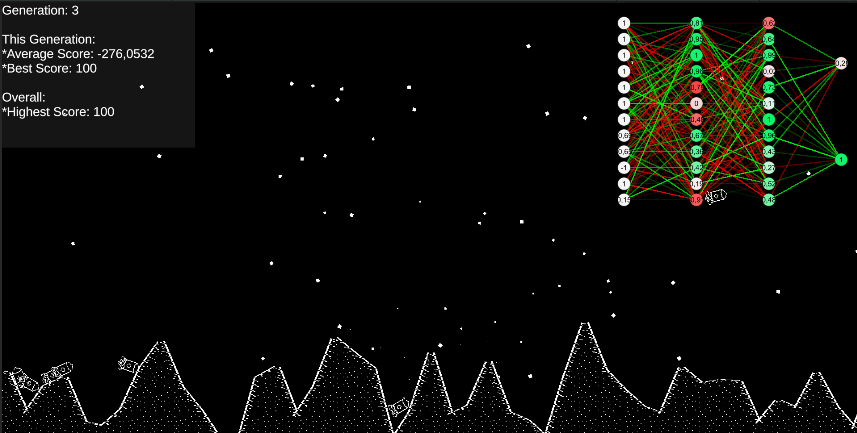
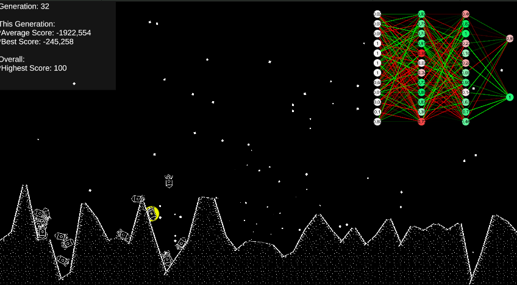

# Lander Machine learning (test)

I wanted to try to make a basic learning ai lander.
The terrain is randomly generated every generation so that the ai learns how to land in general, not just in a specific spot.

They have a bunch of input neurons telling them the distance from the ground in a couple of sensors, what position they have and their velocities.
They have 2 output notes that they can use to control their throttle and their rotational throttle.

In the top left you can see info on the current generation, the average score and the score of their best lander. And lastly the highest score of all landers.
I'm not sure if the scores are being shown/calculated correctly, the highest score has always been 100 for me.

In the top right you can see the neurons of the lander with the highest score in this generation.
The nodes show the value of the node, nodes other than the input nodes also show their "offset" strength, fully green for 1 and fully red for -1.
Between all nodes are lines showing the connections between the nodes, their transparency depicting their magnitude and their colour depicting whether they are positive or negative connections.

The lander with a yellow circle depicts the best lander of that generation.

I had a bug where the ai wouldn't properly get the neurons from their parent, but I'm unsure if it's fixed